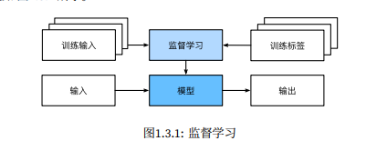
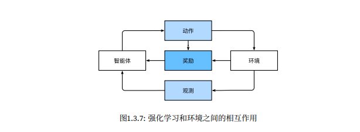

### 机器学习中关键的组件

- 数据
- 模型
- 目标函数
- 优化算法

### 监督学习

监督学习（supervised learning）擅长在“给定输入特征”的情况下预测标签。每个“特征‐标签”对都称为 一个样本（example）。有时，即使标签是未知的，样本也可以指代输入特征。我们的目标是生成一个模型， 能够将任何输入特征映射到标签（即预测）。

- 监督学习是一种机器学习范式，其中模型从带有标签的训练数据中学习如何进行预测。
- 在监督学习中，每个训练样本都包含输入特征和对应的目标标签（或输出）。
- 模型的目标是学习一个输入到输出的映射，以便在给定新的输入时能够准确地预测相应的输出。
- 监督学习的例子包括`分类任务`和`回归任务`。分类任务旨在预测离散标签，而回归任务旨在预测连续数值。

“监督学习”模型像一个打工仔，老板站在 身后，准确地告诉模型在每种情况下应该做什么，直到模型学会从情况到行动的映射

**举例**：

图像分类:

- 训练数据：一组图像数据集，每个图像都包含数字化的像素值。
- 标签：每个图像对应的类别标签，比如“猫”、“狗”、“汽车”等。
- 给模型的方式：模型接收图像像素作为输入，并对应输出每个图像所属的类别

房屋价格预测：

- 训练数据：一组房屋特征数据，如房屋大小、卧室数量、地理位置等。
- 标签：每个房屋的价格。
- 给模型的方式：模型接收房屋特征作为输入，并预测相应房屋的价格

### 无监督学习

- 无监督学习是一种机器学习范式，其中模型从没有标签的数据中学习如何发现数据中的模式和结构。
- 在无监督学习中，训练数据不包含目标标签，模型需要自行发现数据的内在结构或分布。

### 序列学习

在许多传统的机器学习问题中，输入和输出都是固定大小的，但在序列学习中，输入和输出都可以是可变长度的序列。

序列学习是指机器学习领域中一类专注于`处理序列数据`的方法和技术。序列数据是按照时间顺序排列的数据集合，比如文本、语音、时间序列数据等。序列学习的目标是从这些序列数据中提取模式、进行预测或生成新的序列。

在序列学习中，常见的任务包括序列分类（Sequence Classification）、序列标注（Sequence Labeling）、序列生成（Sequence Generation）、序列到序列（Sequence-to-Sequence）学习等。序列学习的方法包括循环神经网络（Recurrent Neural Networks, RNN）、长短期记忆网络（Long Short-Term Memory, LSTM）、变压器（Transformer）等。

序列学习在自然语言处理、语音识别、时间序列预测等领域有广泛的应用，它能够处理具有时序关系的数据，并从中学习并提取有用的信息。

### 强化学习

强化学习的目标就是让`智能体`通过与`环境`的交互，学会在不同情况下做出最优的决策`策略`（policy），以最大化长期累积的`奖励`。智能体通过尝试不同的`行动`，并`观测`环境的反馈，逐渐学习出哪些行动是好的，哪些是不好的。

这个奖励与原始监督学习问题的损失函数是一致的

**举例：**

想象一下你正在玩一款探险游戏，你控制着一个角色穿越各种关卡。在游戏中，你需要做出一系列决策，比如选择何时跳跃、何时攻击怪物、何时躲避陷阱等等。你的目标是通过最佳的决策策略，使你的角色在游戏中取得最高的分数或者通关。

在这个场景中，你就是强化学习中的“智能体”（agent），而游戏就是“环境”（environment）。你所做的每个决策都会影响游戏的状态，比如角色的位置、生命值、得分等等。而环境则会对你的决策做出反馈，比如奖励或惩罚。奖励可以是获得分数或者通过关卡，惩罚则可以是失去生命值或者被怪物攻击。

- 当环境可被完全观察到时，强化学习问题被称为马尔可夫决策过程（markov decision process）。
- 当状态不依赖于之前的操作时，我们称该问题为上下文赌博机（contextual bandit problem）。
- 当没有状态，只有一组 最初未知回报的可用动作时，这个问题就是经典的多臂赌博机（multi‐armed bandit problem）。

**马尔可夫决策过程（Markov Decision Process）：**

- 这指的是一个数学框架，用于描述智能体在与环境交互时做出决策的问题。在MDP中，智能体在不同的状态下可以采取不同的动作，每个动作会导致环境转移到新的状态，并且会产生相应的奖励。关键的特性是状态转移概率和奖励是与之前的状态和动作有关的，但是未来的状态和奖励只依赖于当前状态和采取的动作，而不受之前历史操作的影响

**上下文赌博机（Contextual Bandit Problem）:**

- 在上下文赌博机问题中，智能体在每个时刻都面临选择不同的动作，并且每个动作都与一个上下文相关。智能体根据当前的上下文选择动作，而不需要考虑之前选择的动作序列，因为状态之间是独立的。这种问题可以看作是强化学习的简化版本，更专注于选择动作而不考虑状态的演化

**多臂赌博机（Multi-Armed Bandit Problem）:**

- 在这个问题中，智能体需要在多个动作中进行选择，并且每个动作都有一个未知的潜在回报。智能体的目标是通过与环境的交互，尽量选择那些具有高回报的动作，以最大化长期收益。这个问题的挑战在于，智能体需要在探索和利用之间进行权衡，既要尝试新的动作以发现其回报，又要选择已知回报较高的动作以最大化收益

### 深度学习

`深度学习是机器学习的一个子集`

深度学习是“深度”的，模型 学习了许多“层”的转换，每一层提供一个层次的表示。例如，靠近输入的层可以表示数据的低级细节，而 接近分类输出的层可以表示用于区分的更抽象的概念。由于表示学习（representationlearning）目的是寻 找表示本身，因此深度学习可以称为“多级表示学习”

#### 神经网络（neuralnetworks）

- 线性和非线性处理单元的交替，通常称为层（layers）；

- 使用链式规则（也称为反向传播（backpropagation））一次性调整网络中的全部参数。

#### 重要概念

多层感知机（Multilayer Perceptron，简称MLP）、卷积神经网络（Convolutional Neural Networks，简称CNN）、长短期记忆网络（Long Short-Term Memory，简称LSTM）以及Q学习（Q-Learning）都是机器学习和人工智能领域中的重要概念。下面分别介绍它们的定义和简单示例。

- 多层感知机（MLP）： 多层感知机是一种前馈人工神经网络，它由至少三层节点组成：输入层、隐藏层和输出层。除了输入层节点，每个节点都是一个带有非线性激活函数的神经元。多层感知机可以用来进行分类和回归任务。
  - 示例：手写数字识别。多层感知机可以用来识别28x28像素的手写数字图片（例如MNIST数据集），其中输入层有784个节点（28x28像素），隐藏层可以有多个，每个层可以有不同数量的神经元，输出层有10个节点，分别对应0到9的数字。

- 卷积神经网络（CNN）： 卷积神经网络是一种特殊的神经网络，它特别适合处理具有网格结构的数据，如图像。它通过使用卷积层来自动和层次化地提取图像中的特征。
  - 示例：物体识别。CNN可以用来识别图片中的物体（例如ImageNet数据集）。网络通过一系列卷积层和池化层来提取图像特征，最后通过全连接层进行分类。

- 长短期记忆网络（LSTM）： 长短期记忆网络是一种特殊的循环神经网络（RNN），它能够学习长期依赖信息。LSTM通过引入三个门结构（输入门、遗忘门和输出门）来控制信息的流入流出，有效地解决了传统RNN在长序列学习中遇到的梯度消失和梯度爆炸问题。
  - 示例：机器翻译。LSTM可以用来将一种语言的句子翻译成另一种语言。网络通过读取输入句子并记住关键信息，然后根据这些信息生成目标语言的句子。

- Q学习： Q学习是一种无模型的强化学习算法，它通过学习一个价值函数（Q函数），来估算在给定状态下采取特定动作的期望回报。Q学习的目标是找到一个最优策略，使得从初始状态开始，通过选择最优动作，能够获得最大累积回报。
  - 示例：游戏AI。Q学习可以用来训练一个机器人在简单游戏中（例如贪吃蛇）自动玩游戏。通过不断尝试和学习，机器人能够学会在特定状态下采取最佳动作以获得最高分数

#### 其他概念

- 可微参数（Differentiable Parameters）是指在一个神经网络模型中可以被微分的参数。在机器学习中，特别是深度学习中，我们通常使用梯度下降算法来优化模型的参数，以最小化损失函数。为了能够使用梯度下降，损失函数必须相对于模型参数是可微的，这意味着参数必须能够计算其梯度。

  可微参数主要包括以下几类：

  1. 权重（Weights）：连接神经网络中相邻两层神经元的参数，用于表示不同特征或神经元之间的关联强度。
  2. 偏置（Biases）：加到每个神经元的激活函数输入上的常数，用于调整神经元的输出。
  3. 核参数（Kernel Parameters）：在卷积神经网络中，卷积核的参数用于在输入数据上滑动时提取特征。
  4. 尺度参数（Scaling Parameters）和位移参数（Shift Parameters）：在某些网络层中，如批量归一化（Batch Normalization）层，这些参数用于对数据进行缩放和平移。
  5. 门控参数（Gating Parameters）：在长短期记忆网络（LSTM）和其他门控循环单元中，用于控制信息的流动。

- 新的容量控制方法：如dropout，有助于减轻过拟合的危险。这是通过在整个神 经网络中应用噪声注入(Bishop,1995)来实现的，出于训练目的，用随机变量来代替权重
- 注意力机制：如何在不增加可学习参数的情况下增加系统的记忆 和复杂性。
- 多阶段设计：
- 生成对抗网络：

数据和算法的关系是：

- **数据**：数据是数字时代的“燃料”，它为人工智能提供信息。就像煤炭为蒸汽机提供能量一样，数据为算法提供知识和洞察力。数据可以是结构化的，也可以是非结构化的，它涵盖了从用户行为、传感器读数到文本和图片等方方面面。
- **算法**：算法是处理数据的“引擎”，它通过特定的计算模型和规则，从数据中提取信息、发现模式、做出预测或执行特定任务。算法的复杂性远远超过了蒸汽机的热力学原理，它们能够进行自我学习和优化，这是传统蒸汽机所不具备的。

